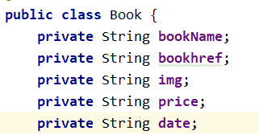
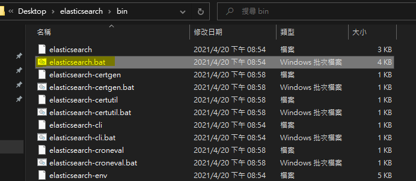
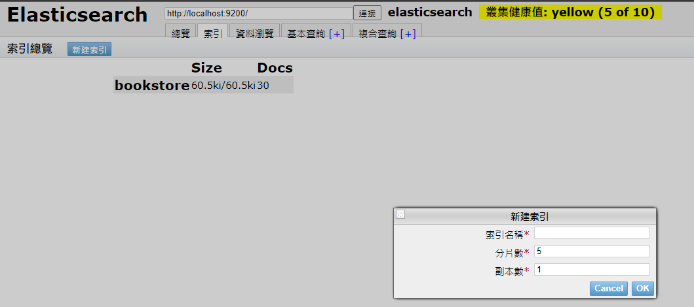
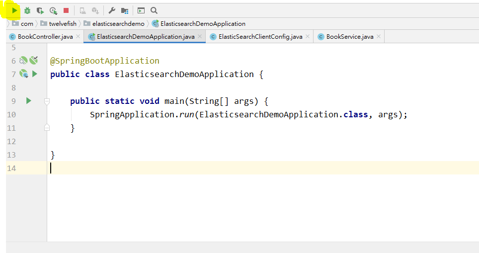
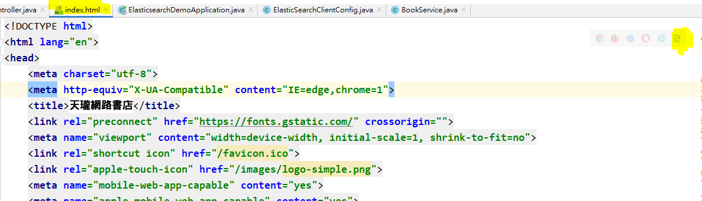
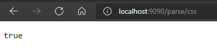
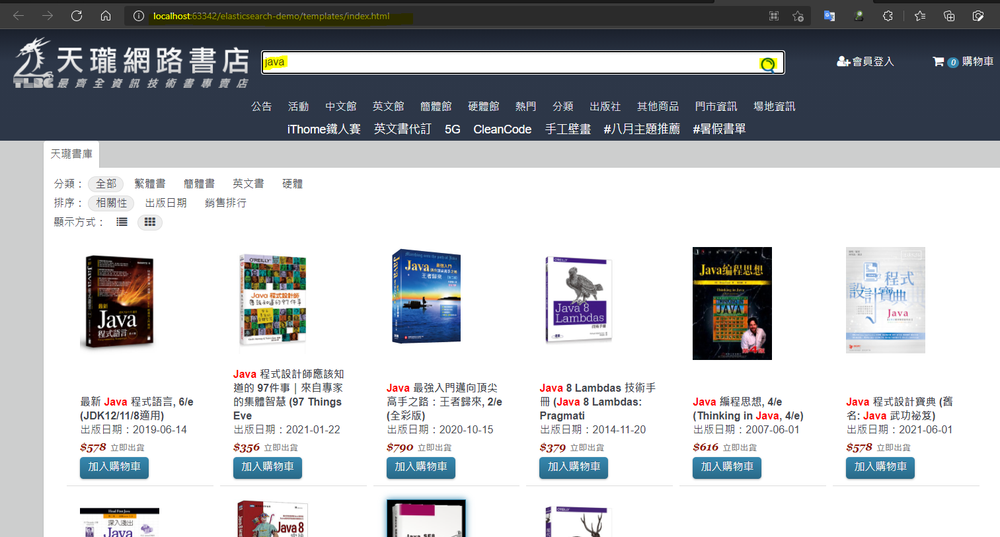

# ElasticSearch demo
前後端分離，資料庫為 ElasticSearch 的網路書局

demo 重點為展示出 ElasticSearch 在全文搜索時的快速

---

## 為何使用 ElasticSearch

1、資料格式為

2、elasticSearch data

3、針對書名進行全文搜索，elasticSearch 使用倒排索引模式，搜索速度較快，如果使用SQL資料庫需使用 like 模糊查詢語法，會造成效能較差

---

## 使用技術

1、Spring boot 2.5.4

2、vue.js

3、ElasticSearch 7.12.1

4、網路爬蟲

5、cdn axios

---

## 重點介紹

1、使用 Spring boot 框架建立後端

2、使用 Java Jsoup 套件進行網路爬蟲

3、URL 參數進行 UTF-8 編碼 

4、使用整合的 spring-boot-starter-data-elasticsearch 撰寫 elasticsearch API

5、使用 Java gson 套件將 list 轉換為 Json

6、前端為 63342 port，後端 API 為 9090 port，需進行 cross-site

7、使用 vue.js 進行前端雙向綁定

8、使用 cdn 的方式使用 axios.js 進行呼叫後端 API

---

## 運行

Windows底下運行即可

1、至官網下載 ElasticSearch 7.12.1 並執行 elasticsearch.bat，port 號為 9200

2、可至 config/elasticsearch.yml 更改 port 號，程式碼 ElasticSearchClientConfig.java 也要一併更改

3、安裝瀏覽器 elasticsearch-head 插件，確認 elasticsearch 執行成功

4、新建索引 bookstore

5、執行 spring boot 和 前端畫面

http://localhost:63342/elasticsearch-demo/templates/index.html

6、執行爬蟲，爬蟲可能因應 "參考網站天龍書局排版異動而失效"
http://localhost:9090/parse/ + 參數

回傳 true及成功

7、確認 elasticsearch 資料存入成功

8、打開瀏覽器，輸入文字進行全文搜索

9、針對書名上的關鍵字會特別顯示紅色字體，進行展示

---

https://medium.com/twelvefish

如果你喜歡我的創作，請大力地給我拍拍手 🐊 🐊 🐊